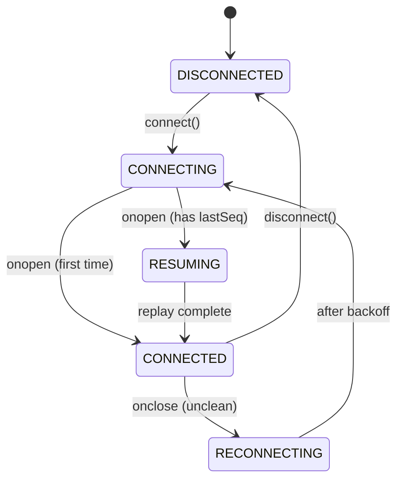

# Agent Console

A Next.js application that connects to a mock AI agent backend over WebSockets, renders streaming responses with mid-stream tool call interruptions, displays a live agent trace timeline, and survives chaos mode without crashing or losing state.

## Architecture

The application is split into three strict layers: **Protocol** (pure TypeScript WebSocket management with seq-based reordering and deduplication), **State** (Zustand stores for chat streams, trace events, and context snapshots), and **Render** (React components that subscribe to stores via selectors). This separation ensures the protocol logic is testable without React, and the render layer never touches WebSockets directly.

The core innovation is the **segment model** for streaming responses: each agent message is an ordered list of `TextSegment | ToolCallSegment` entries. When a tool call interrupts mid-stream, the text freezes structurally (not via CSS tricks) and a tool card is appended below. This prevents layout shift by design.

## State Machine



**Backoff**: 500ms → 1s → 2s → 4s → cap at 10s.

## Quick Start

```bash
# 1. Start the mock agent backend
cd agent-server
docker build -t agent-server .
docker run -p 4747:4747 agent-server

# 2. Install and run the frontend
cd agent-console-app
npm install
npm run dev
# Open http://localhost:3000 (or http://localhost:3001 if 3000 is occupied)

# 3. Test chaos mode
docker run -p 4747:4747 agent-server --mode chaos
```

## Build & Run (Production)

```bash
cd agent-console-app
npm install
npm run build
npm run start
```

## Run Tests

```bash
cd agent-console-app
npm test
```

## Project Structure

```
├── agent-console-app/       # Next.js 14 App Router project
│   ├── src/                 # Application source code
│   │   ├── app/             # Next.js App Router (layout, page, global css)
│   │   ├── lib/             # Protocol layer & Zustand stores
│   │   │   ├── protocol/    # WebSocket state machine, reorder buffer, heartbeat
│   │   │   ├── stores/      # Zustand state stores (chat, trace, context, connection)
│   │   │   ├── hooks/       # use-agent hook integrating protocol and stores
│   │   │   └── utils/       # json-diff engine and escape hatch utility
│   │   └── components/      # React components (Chat, Timeline, Context, Connection)
│   ├── __tests__/           # Jest unit tests
│   └── package.json, tsconfig.json, next.config.js
├── agent-server/            # Mock agent backend
├── README.md                # General setup and documentation
└── DECISIONS.md             # Deep-dive architectural justification
```

## 🎥 Chaos Mode Demo Video

> [!IMPORTANT]
> **Video Link**: [Insert your Loom or YouTube Unlisted video link here]
>
> This 3-5 minute screen recording demonstrates the console running against `agent-server` in **Chaos Mode** and highlights:
> 1. **Connection drop mid-stream**: Connection drops, client transitions to "Reconnecting", then auto-resumes mid-word without duplicate text or DOM resets.
> 2. **Out-of-order messages**: Timeline automatically sorts jumbled messages by their sequence number (`seq`).
> 3. **Rapid tool calls**: Handles multiple overlapping tool cards stacked sequentially.
> 4. **Oversized context snapshot**: Handles 500KB+ state dumps without UI freeze or performance drops.
> 5. **Corrupt heartbeat**: Heartbeat manager continues running when PING messages contain empty challenges.

## 🖼️ Application Screenshots

### 1. Normal Mode Chat & Tool Card


### 2. Event Trace Timeline


### 3. Context Inspector & Diff Tree


## Tech Stack

- **Framework**: Next.js 14 (App Router)
- **Language**: TypeScript (strict mode)
- **State**: Zustand
- **Styling**: CSS Modules
- **Testing**: Jest + ts-jest
